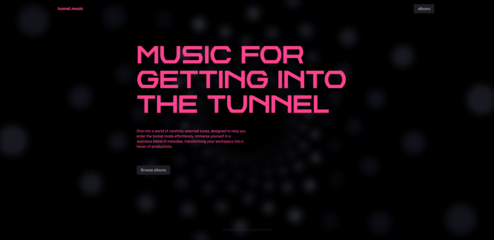

<!-- Template taken from https://github.com/othneildrew/Best-README-Template/ -->

    <h3>tunnel.music</h3>
    
This repository holds the code for tunnel.music.

    <a href="https://tunnelmusic.netlify.app">Visit tunnel.music</a>
      
    

## About tunnel.music
tunnel.music is a website that showcases music albums. It is built with Nuxt.js, Tailwind CSS, TypeScript, and Vite. The website is hosted on Netlify.

### Built With

[![Nuxt][nuxt.com]][nuxt-url]
[![Vue][vue.js]][vue-url]
[![Tailwind][tailwindcss.com]][tailwind-url]
[![TypeScript][typescriptlang.org]][typescript-url]
[![ESLint][eslint.org]][eslint-url]
[![Prettier][prettier.io]][prettier-url]
[![Vite][vitejs.dev]][vite-url]
[![Netlify][netlify.com]][netlify-url]
[![Pinia][pinia]][pinia-url]

[eslint.org]: https://img.shields.io/badge/ESLint-4B3263?style=for-the-badge&logo=eslint&logoColor=white
[eslint-url]: https://eslint.org/
[netlify.com]: https://img.shields.io/badge/netlify-00C7B7?style=for-the-badge&logo=netlify&logoColor=white
[netlify-url]: https://netlify.com
[nuxt.com]: https://img.shields.io/badge/Nuxt-002E3B?style=for-the-badge&logo=nuxtdotjs&logoColor=#00DC82
[nuxt-url]: https://nuxt.com/
[pinia]: https://img.shields.io/badge/pinia-4B3263?style=for-the-badge&logo=pinia&logoColor=white
[pinia-url]: pinia.vuejs.org/
[prettier.io]: https://img.shields.io/badge/Prettier-F7B93E?style=for-the-badge&logo=prettier&logoColor=white
[prettier-url]: https://prettier.io/
[tailwindcss.com]: https://img.shields.io/badge/tailwindcss-%2338B2AC.svg?style=for-the-badge&logo=tailwind-css&logoColor=white
[tailwind-url]: https://tailwindcss.com
[typescriptlang.org]: https://img.shields.io/badge/TypeScript-007ACC?style=for-the-badge&logo=typescript&logoColor=white
[typescript-url]: https://typescriptlang.org
[vue.js]: https://img.shields.io/badge/Vue.js-35495E?style=for-the-badge&logo=vuedotjs&logoColor=4FC08D
[vue-url]: https://vuejs.org/
[vitejs.dev]: https://img.shields.io/badge/Vite-646CFF?style=for-the-badge&logo=vite&logoColor=white
[vite-url]: https://vitejs.dev/